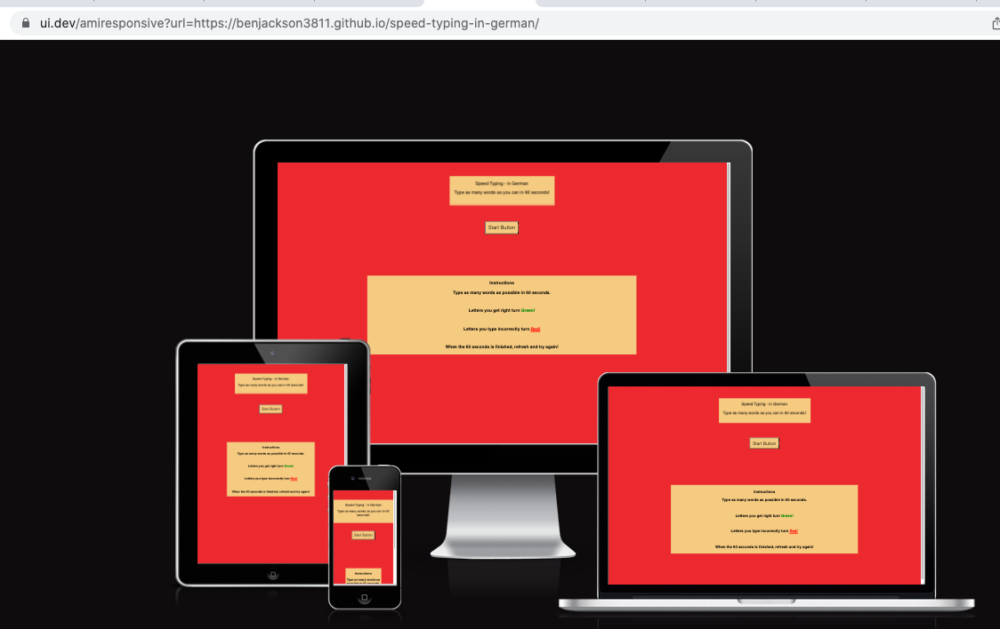
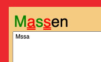

# [Speed Typing in German](https://benjackson3811.github.io/speed-typing-in-german/)

## Introduction
Speed Typing in German is a basic speeding typing game. It is designed to provide the user a game where they can practise spelling and typing as many German language words as possible in a 60 second period.

Start your lesson in 

## Table of Contents

[Introduction](#introduction)

[Table of content](#table-of-content)

[User Experiance](#user-experiance)
- [Target audience](#target-audience)
- [User Requirements and Expectations](#user-requirements-and-expectations)
- [User Stories](#user-stories)
- [Site Designer Stories](#site-designer-stories)
- [Site Structure](#site-structure)

[Design Choices](#design-choices)

[Wireframes](#wire-frames)

[Features](#features)
- [header](#header)
- [Instructions](#instructions)
- [Timer](#timer)
- [Word to Type](#word-to-type) 
- [Typed Word](#typed-word)
- [Responsive Elements](#responsive-elements)
- [Scores Area](#scores-area) 

[Future-features](#future-features)

[Technologies used](#technologies-used)

[Testing](#testing)

[Deployment](#deployment)
- [Steps](#steps)
- [Live link](#live-link)

[Credits](#credits)
- [Content](#content)
- [Media](#media)

[Acknowledgements](#acknowledgments)
[Back to top](#content)

### User Experiance
- ### Target audience
* German Learners
- ### User Requirements and Expectations
* A simple and responsive game that lets the user type as many german words as possible in 60 seconds. Secondly, showing immediate feedback if errors are made.
- ### User Goals
* I want to be able to navigate through the site smoothly.
* I want to be able to understand immediately the purpose of the site.
* I want a new word to type automatically after I have finsihed my previous word.
* I want to see if I have made any mistake typing the letters of the word
- ### Site Designer Goals
* I want to provide a site for the user where they can practise spelling German Language words for education purposes.
* I want to create a simple and easy to navigate site.
* I want the site to provide immediate feedback whether the letters are spelt correctly/ incorrectly.
* I want the user to be able to start typing directly.
- ### Site Structure
The website is a simple page structured in HTML and CSS. The gamepage is using Javascript for the interactive areas;
- The single page is split into areas which the user gets visbility off after clicking the start button. 
- On page load - the user can see the header, start button and footer that shows the instructions.
- After clicking the start button, the start button and footer are hidden showing the timer, character score, word display and word input areas.
[Back to top](#content)

### Design Choices
* The colours used in the website were from a palete from [Coolors](https://coolors.co/). The picture were picked because they provided a bright and summmery color scheme.
* Fonts. The font picked for the website was Poopins from [Google Fonts](https://fonts.google.com/) this was compliment the colours picked.
[Back to top](#content)

### Wireframes

The wireframes for the site were created using [Balsamiq](https://balsamiq.com). Wireframes were created for Laptop, mobile and tablet screen sizes.

[Back to top](#content)

### Features
Speed Typing in German is set up to basic and be very easy to use. There is a liner user story where the user can see the header, start button and instructions on the page footer. On clicking the start button they see the word displayed to type, a timer and an area where they can type.
- ### Header

The Header area shows the game title and the call to arms "Type as many words as you can in 60 seconds'.
- ### Instructions

The instructions have been placed in the footer area to provide more space in the screen. The user can see them clearly on going on the page and immediately knew key detaails about the page.
- ### Start Button

The game start button.
- ### timer - 60-seconds

Shows the user how much time has passed. Stops on 60 seconds.
- ### Word to Type 

Random words generated for the user to practise their typing. To add added complexitity they are not all capitalised.
- ### Typed Word

The area for the user to type the diplayed german word.
- ### Responsive Elements

The responsive element of the game showing the correct letter in green and the incorrect letter in red.
- ### Scores Area 

Shows the total number of characters typed. A score is not logged because of the responsive element of the game, the user can see when they have typed a correct character (through it showing green).
[Back to top](#content)

### Future-features
At the minute the game is very basic using basic levels of Jasic script to make the game interactive. Further game functionality that can bee added is.
- A refresh button.
- A correct/ incorrect score button.
- A total score button.
- A translate of the German words displayed into English
[Back to top](#content)

### Technologies used
* [Balsamiq](https://balsamiq.com)
* [Coolors](https://coolors.co/)
* [Google Fonts](https://fonts.google.com/)
* [HTML5](https://www.w3schools.com/html/html_intro.asp) - for content and website structure. 
* [CSS](https://www.w3schools.com/css/css_intro.asp)- for Website styling.
* [Javascript](https://www.w3schools.com/js/default.asp) - to make the website interactive.
* [lingua.com](https://lingua.com/pdf/deutsch-text-flughafen.pdf) - Source of German text.
[Back to top](#content)

### Testing
Please refer to [TESTING.md](TESTING.md).
[Back to top](#content)

### Deployment
- ### Steps
The site has been deployed into Github. The steps to deploy are;
1. In the github repository, navigate to the pages **settings** tab.
2. Once in settngs, navigate to the **pages** tab on the left hand side. 
3. Click on the source section - below the URL- then click save.
4. Once the selected, the page will automatically refresh with a detailed ribbon display to indicate the successful deployment.
- ### Live link(https://benjackson3811.github.io/speed-typing-in-german/)
[Back to top](#content)

### Credits
- ### Content
* Wireframe - [Balsamiq](https://balsamiq.com)
* Font came from [Google Fonts](https://fonts.google.com/)
* Colour palete came from [Coolors](https://coolors.co/)
* Love Maths - Game Ideas
* For Quiz Game structure ideas.
- Acradea Building a Speed typing game - https://www.youtube.com/watch?v=yZ93TTdGxa8
- Web Dev Simpified - https://www.youtube.com/watch?v=R-7eQIHRszQ
* For the word inspect function and correct letter functionality.
- Web Dev Simpified - https://www.youtube.com/watch?v=R-7eQIHRszQ
* Javascript countdown time.
- https://www.w3schools.com/howto/howto_js_countdown.asp
- Tutor support. 

[Back to top](#content)

### Acknowledgements
I would like to thank my mentor Precious Ijege for with patience and practical advise. The tutoring team for the time and explanations of the problems I brought to them.
[Back to top](#content)