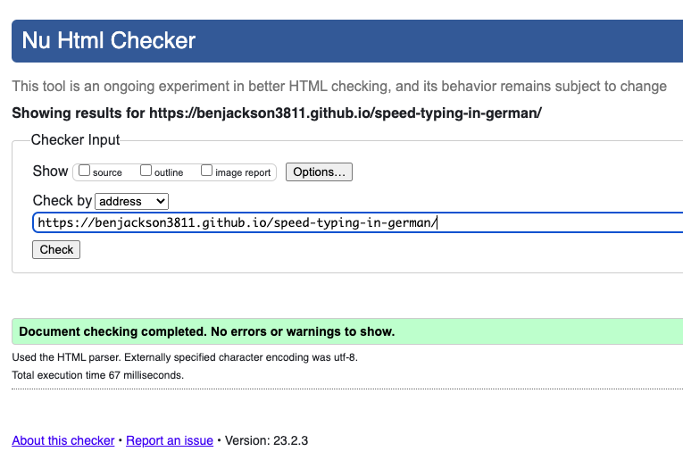
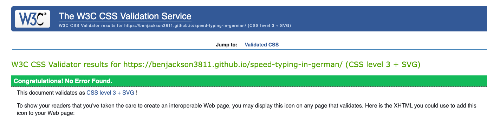
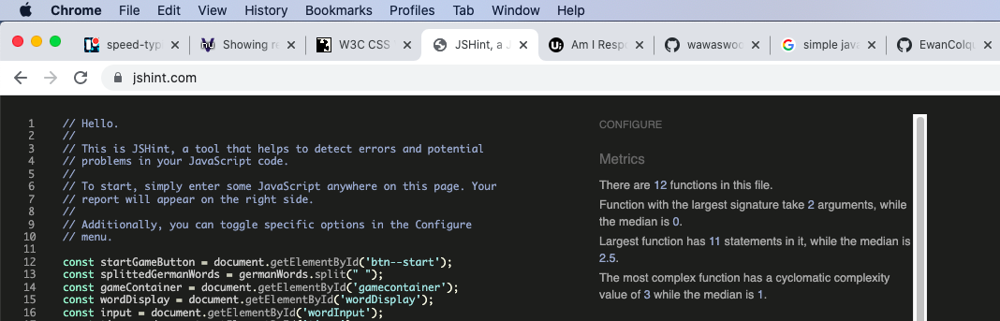
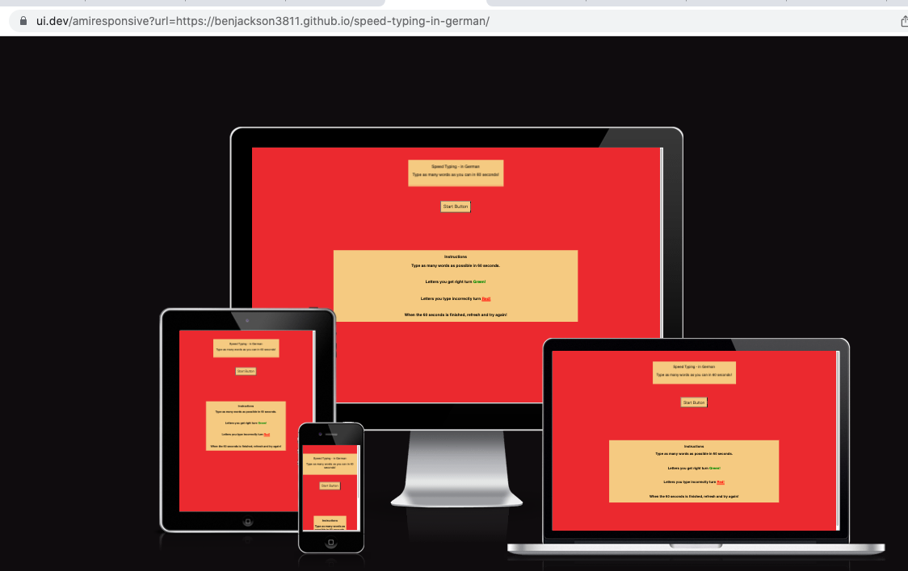
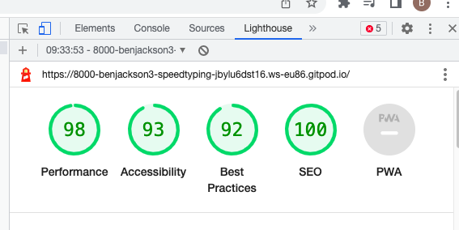
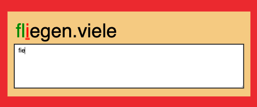
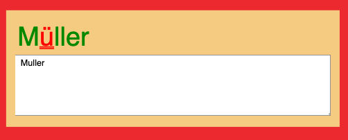
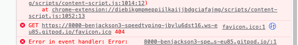
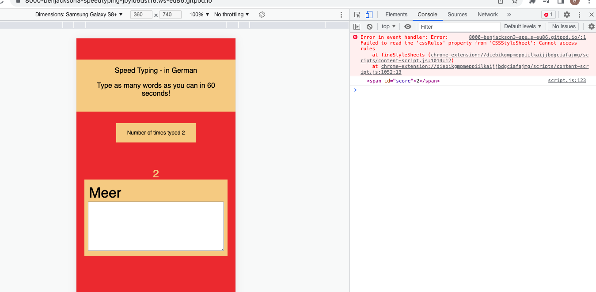

### Testing

### Validation Testing
While a basic, Speed Typing in German has been throughly tested. The code has been validated in HTML, CSS and JS validators.

* HTML Validation.

* CSS Validation

* JS Hint Validation

- ### Responsive Design
The responsive nature of the website has been checked using two sources on multiple browsers. The check was to confirm that the website fits on the different avaliable screensize and product models.
1. The inspect page functionality on (Google Chrome DevTools)(https://developer.chrome.com/docs/devtools) 

|      |Iphone SE|Iphone XR| Samsung Galaxy| Surface|Ipad|Laptop 1200px|
|------|---------|---------|---------------|--------|----|-------------|
|Render| Yes     | Yes     |     Yes       | Yes    | Yes| Yes         | 
|Links | Yes     | Yes     |     Yes       | Yes    | Yes| Yes         |

The site was tested on the following browsers with no visible issues for the user. 
 - Google Chrome,
 - Microsoft Edge,
-  Safari
-  Mozilla Firefox. 

Appearance, functionality and responsiveness were consistent throughout for a range of device sizes and browsers

2. (Responsive Design Checker)(https://ui.dev/amiresponsive)

Using further testing was done using a LightHouse report on (Google Chrome DevTools)(https://developer.chrome.com/docs/devtools).

## Testing user stories.
The end products has been tested back against the inital user stories. 

- ### User Goals
* I want to be able to navigate through the site smoothly.
- This is possible to do through the start button.
* I want to be able to understand immediately the purpose of the site.
- The instructions are clearly shown in the page footer.
* I want a new word to type automatically after I have finsihed my previous word.
- This is possible on the site.
* I want to see if I have made any mistake typing the letters of the word
- Through the site functionality the correct characters show green while incorrect shows red.
- ### Site Designer Goals
* I want to provide a site for the user where they can practise spelling German Language words for education purposes.
- The completed site allows this.
* I want to create a simple and easy to navigate site.
- This is possible to do through the start button. The user can see the instructions then navigate to the game.
* I want the site to provide immediate feedback whether the letters are spelt correctly/ incorrectly.
Through the site functionality the correct characters show green while incorrect shows red.
* I want the user to be able to start typing directly.
- This is possible after pressing the start button.

- ### Bugs and Errors found
1) The idea for the render new word function code was taken from https://www.youtube.com/watch?v=yZ93TTdGxa8. The bug found was after the word was successfully typed and new word was rendered, however you have to type the inital word and then the second word.
this was fixed by adding a section to the formula to change the innerText of the wordDisplay formula showing the '' after the word has been correctly typed.

2) The English keyboard is not set up for easy typing of german punctuation - for example on the word Müller. 
Words that had umlaut were taken out of the german.words.js data source.

3) Favicon. The Favicon added was not loading. This was due to it not having the link added in HTML.

4) The Character Logging. Through time remaining this is an outstanding bug. 
.
As you can see on the screen shot the log does not start on zero. This is a function error that through lack of time has not been fixed.

Back to [README.md](add file link).